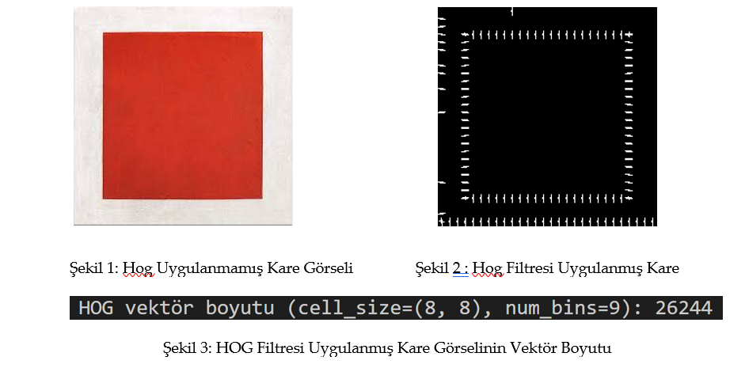
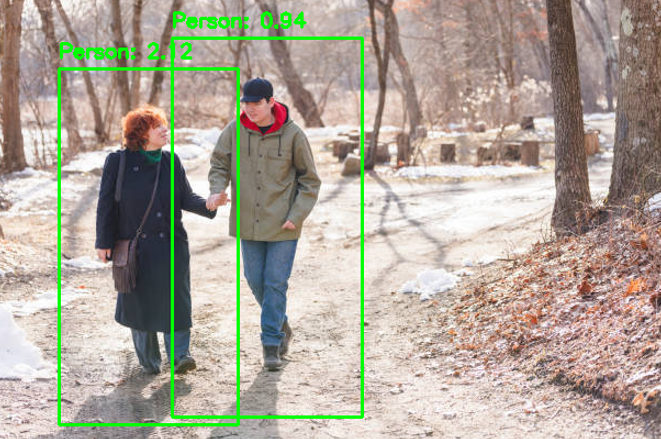
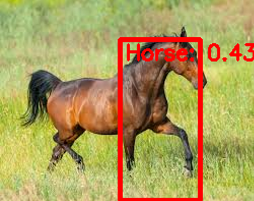
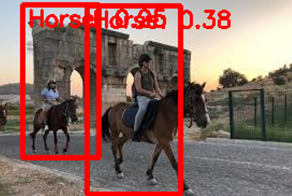
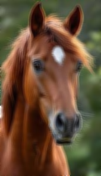
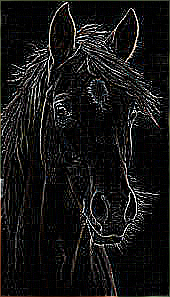
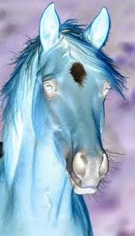
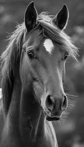
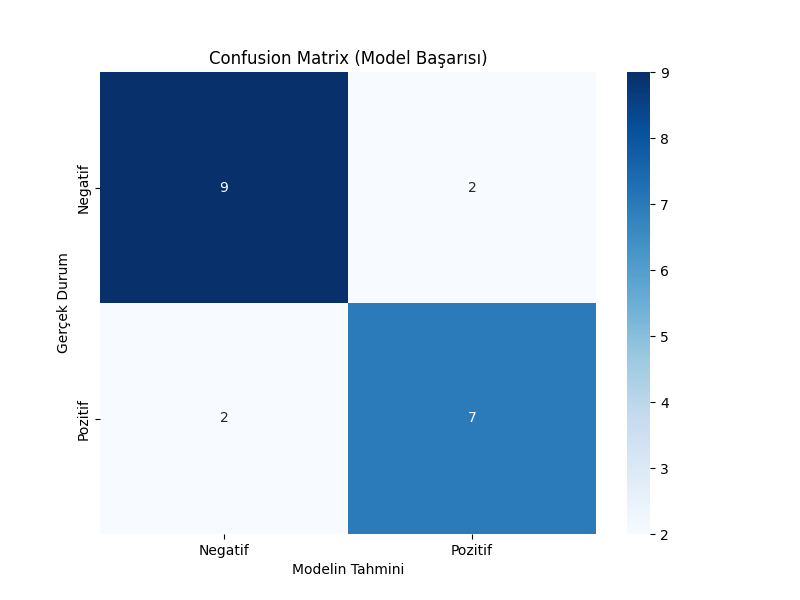

# **OOP Tabanlı Görüntü İşleme & Nesne Tespiti (HOG + SVM)**


Bu repo, klasik ve ileri seviye görüntü işleme algoritmalarını **Nesne Tespiti (Person + Horse)** pipeline’ı ile birleştirir.  
Tüm modüller **OOP (Object-Oriented Programming)** mantığıyla yazılmış ve **GUI üzerinden interaktif test** imkânı sunar.
Örnek GUI ekranı


## A) Filters — Görüntü Ön İşleme Aşamaları

### a.1) Basic Filters
- `Blur` → Temel bulanıklaştırma
- `Sharpen` → Keskinleştirme
- `Edge Detect` → Kenar tespiti
- `Emboss` → Kabartma efekti

### a.2) Color Filters
- `Grayscale` → Gri tonlama
- `Sepia` → Sepya ton filtresi
- `Invert` → Renk ters çevirme
- `Solarize` → Solarizasyon efekti

### a.3) Advanced Filters
- `Gaussian Blur` → Gauss tabanlı yumuşak bulanıklaştırma
- `Motion Blur` → Hareket efekti bulanığı
- `Canny Edge` → Canny kenar tespiti
- `Median Filter` → Gürültü azaltmada medyan filtresi

---

## B) Adjustments — Görsel Ayar İşlemleri

### b.1) Brightness
- `Increase Brightness`
- `Decrease Brightness`

### b.2) Contrast
- `Increase Contrast`
- `Decrease Contrast`

---

## C) Advance Processing — Nesne Tespiti Pipeline’ı

- `HOG Descriptor` → Görüntüden **kenar ve yön histogramı** çıkaran özellik temsili
- `Person Detection` → OpenCV’nin hazır **HOG + SVM People Detector** modeliyle multi-scale insan tespiti + NMS + confidence score
- `Custom Detection (Horse)` → HOG özellikleri kullanılarak eğitilen **SVM modeli + Sliding Window + Multi-Scale + NMS** ile at tespiti
- `Custom Detection` → Aynı pipeline farklı nesnelere uygulanabilir
- `GUI Test` → Tüm işlemler OOP GUI şablonunda **filtre olarak entegre** edilip kullanıcı tarafından denenebilir

---

## Test Görselleri

### HOG Filter


### Person Detection (İnsan Tespiti)



### Custom Detection — Horse (At Tespiti)



> Not: Görseller **multi-scale tarama + NMS** sonrası en iyi tespit kutularını göstermektedir. Skorlar GUI’de güven (confidence) değeri olarak sunulur.


### Bazı Filtre Sonuçları

| Orijinal | Sharpen | Blur | Edge Detect | Invert | Gray Scale |
|----------|----------|----------|----------|----------|----------|
|  |  |  |  |  |  


## Proje Akışı 
1. Görüntü gri tona çevrilir
2. Gradient’ler hesaplanır
3. Hücre histogramları çıkarılır
4. Blok normalizasyonu (L2-norm + ϵ)
5. Descriptor’lar birleştirilir
6. Multi-scale tarama yapılır
7. NMS ile en iyi kutular seçilir
8. Confidence skorları GUI’de gösterilir

---

## Deneysel Bulgular
 ### Confusion Matrix
 
 
  Model 20 test örneği üzerinde değerlendirilmiştir.  
  Pozitif ve negatif sınıflar için Precision, Recall ve F1-score dengelidir (~%78).  
  Genel doğruluk (Accuracy) **%80**

- HOG kenar/yön bazlı tespitte **güçlüdür**
- Karmaşık sahnelerde false positive ve düşük confidence görülebilir.
- Dataset dengesi ve kalitesi sonucu **doğrudan etkilemektedir**

---
## Kurulum & Çalıştırma
Gerekli bağımlılıklar:
```bash
pip install -r requirements.txt
```
---
Uygulamayı başlatma:
---
```bash

python main.py
